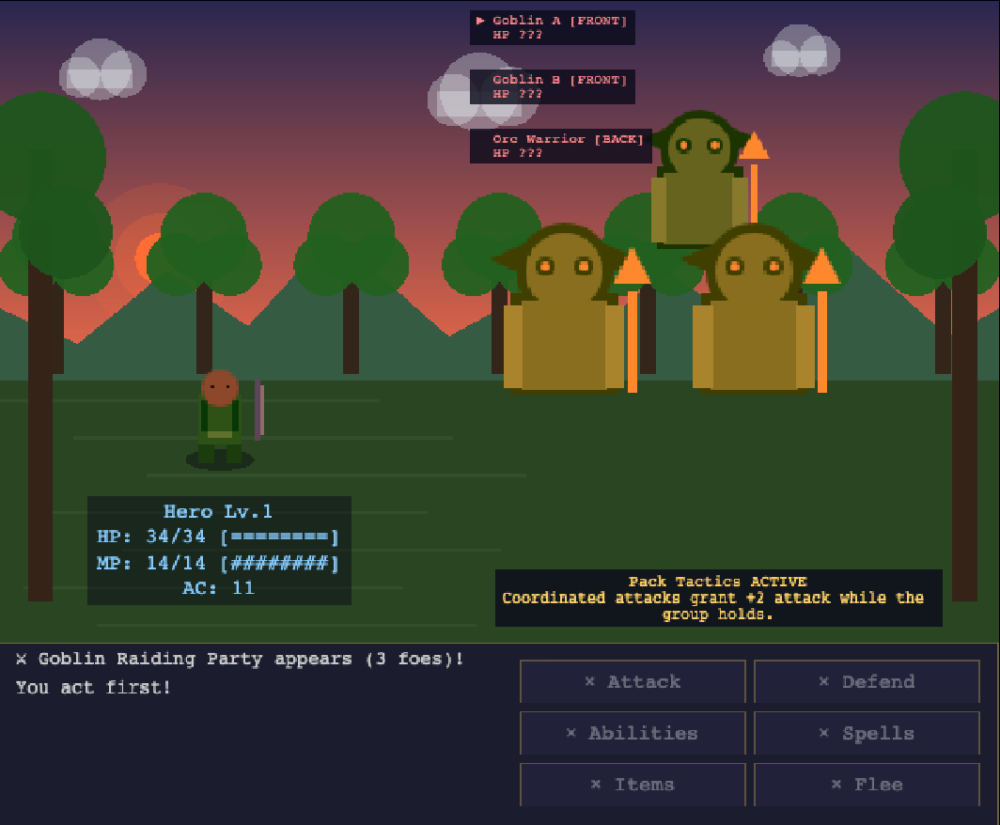

# 2D&D

[](https://github.com/mbianchidev/2dnd/releases/latest)
[](https://github.com/mbianchidev/2dnd/actions/workflows/pr.yml)
[](https://github.com/mbianchidev/2dnd/actions/workflows/deploy.yml)
[](https://github.com/mbianchidev/2dnd/actions/workflows/release.yml)
[](https://github.com/mbianchidev/2dnd/actions/workflows/codeql.yml)
[](LICENSE)

**A browser JRPG with Dragon Quest-style exploration and D&D 5E-inspired
combat.** 

Build a hero, recruit a party, cross a 90-chunk world, and complete
the seven-chapter Twelvefold Covenant campaign.



**[Visit the showcase](https://mbianchidev.github.io/2dnd/)** |
**[Play 2D&D now](https://mbianchidev.github.io/2dnd/game.html)** |
**[Download desktop builds](https://github.com/mbianchidev/2dnd/releases/latest)**

Current release: **v1.0.0**

2D&D runs entirely in the browser. Its pixel-art textures are generated at
runtime, its music and sound effects are synthesized with the Web Audio API,
and campaign saves stay in your browser's local storage.

## Highlights

- **Create your hero:** choose from 12 classes, use 27-point buy or
  4d6-drop-lowest stats, customize appearance, level to 20, and collect
  equipment, talents, spells, abilities, and mounts.
- **Complete a full campaign:** follow the Twelvefold Covenant through 12
  mainland cities, three keystone dungeons, data-driven cutscenes, boss
  encounters, an epilogue, and post-game continuation.
- **Build a party:** recruit the Guardian, Scout, and Mystic; manage their
  equipment and inventories; control them manually or automate turns with
  ranked gambits.
- **Fight tactical battles:** face groups of up to four enemies with initiative,
  formations, ally and enemy targeting, nine elements, status effects, healing,
  items, bosses, and full-party defeat recovery.
- **Explore a changing world:** travel through connected city districts,
  multi-level dungeons, seeded traps, fog of war, weather, day and night,
  non-combat skill checks, World Events, and optional danger zones.
- **Discover more than monsters:** expand the Codex with lore, make alignment
  and reputation choices, earn achievements and cosmetic titles, and replay
  unlocked story scenes in the Chronicle.
- **Gather, craft, and sail:** fish, mine, forage, craft deterministic recipes
  and equipment upgrades, use merchant routes, earn a boat, explore Tidehaven,
  and challenge the Deepwake Kraken.
- **Play your way:** use keyboard, pointer, touch, or a standard gamepad.
  Accessibility settings include 100%/125%/150% text, high contrast, reduced
  motion, adjustable audio, cutscene advance options, and adaptive prompts.

See the [gameplay guide](docs/gameplay.md) for controls, progression, and player
guidance.

## Browser, desktop, and save support

2D&D is designed for current desktop and mobile browsers. Release CI validates
the game in Chromium; other current evergreen browsers are expected to work but
are not part of the automated browser gate.

The source also includes a secure Electron target for macOS, Windows, and Linux.
Pull requests produce short-lived unsigned review artifacts. A version tag that
matches `package.json` runs the full release gate, packages all three platforms,
and attaches the unsigned builds to the matching GitHub release. The current
v1.0.0 release predates that publishing workflow. See the
[desktop guide](docs/desktop.md) for security, signing, and packaging details.

Each profile has a dedicated autosave, three named manual campaign slots,
per-slot backup recovery, and validated JSON import/export. Accessibility/audio
settings and inventory-view preferences remain separate. Saves do not
automatically sync between browsers, devices, private windows, or cleared site
data. The game has no account system, analytics, or server-side save service.

## Run locally

The CI baseline is Node.js 24 with npm.

```bash
git clone https://github.com/mbianchidev/2dnd.git
cd 2dnd
npm ci
npm run dev
```

Open `http://localhost:3000` for the showcase or
`http://localhost:3000/game.html` for the game.

```bash
npm run typecheck      # Strict TypeScript validation
npm test               # Full Vitest suite
npm run test:browser   # Full Playwright/Chromium suite
npm run test:desktop   # Production-like Electron smoke suite
npm run build          # Type-check and build dist/
npm run build:desktop  # Type-check and build the desktop renderer and shell
```

Install Chromium once before the browser suite with
`npm run test:browser:install`.

Use `npm run dev:desktop` for Electron development and
`npm run package:desktop` for unsigned artifacts on the current host.

## Documentation

| Guide | Contents |
| --- | --- |
| [Documentation index](docs/README.md) | Complete documentation map |
| [Getting started](docs/getting-started.md) | Installation, local hosting, saves, troubleshooting |
| [Gameplay](docs/gameplay.md) | Controls, campaign, combat, exploration, accessibility |
| [Architecture](docs/architecture.md) | Scene flow, domain ownership, input, transitions, procedural assets |
| [Development](docs/development.md) | Conventions, feature placement, debug tools, dependencies |
| [Testing](docs/testing.md) | Vitest, Playwright, layout/accessibility checks, CI gates |
| [Save system](docs/save-system.md) | Schema v17, migration, recovery, persistence rules |
| [Desktop application](docs/desktop.md) | Electron security, storage, development, packaging |
| [Release](docs/release.md) | GitHub Pages and release checklist |
| [Companions and gambits](docs/companions.md) | Party state, recruitment, AI, combat integration |
| [Inventory presentation](docs/inventory.md) | Ownership-safe sorting, filtering, controls, transfers |

## Contributing

Read [AGENTS.md](AGENTS.md), the
[development guide](docs/development.md), and the
[testing guide](docs/testing.md) before changing the game. Open an
[issue](https://github.com/mbianchidev/2dnd/issues) for bugs or proposals and
submit changes through a pull request.

## License

2D&D is licensed under the [GNU Affero General Public License v3.0](LICENSE).
